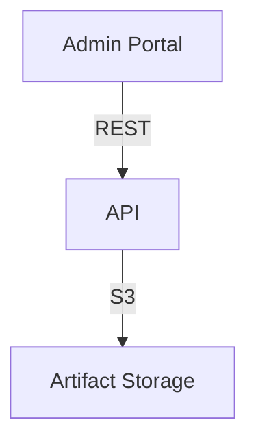

# Template: SYSTEM.md

Write this document for the entire project. It captures the cross-component
architecture — how pieces fit together, not how each piece works internally.

---

## Required Sections

### System Overview

One paragraph: what does this system do, who uses it, what problem does it solve?

### Component Map

Table of all components with their role:

```
| Component | Location  | Stack        | Role                              |
|-----------|-----------|--------------|-----------------------------------|
| api       | apps/api  | Clojure/Ring | REST API, business logic, auth    |
| admin     | apps/admin| Angular 21   | Internal admin dashboard          |
```

### Architecture Diagram

Mermaid diagram showing components and their connections:



### Request Flows

Trace 2-3 key user flows through the system. For each:

- Which components are involved
- What data moves between them
- What protocols/formats (REST, gRPC, events, shared DB)

### Shared Resources

List resources used by multiple components:

- Databases (which components read/write)
- Storage (buckets, keys)
- Auth (shared tokens, SSO, session stores)
- Config (shared environment variables, secrets)

### Deployment Topology

How components are deployed:

- Where each component runs (container, serverless, static hosting)
- Network relationships (same VPC, public internet, internal only)
- Scaling characteristics

### Architectural Decisions

Key decisions that affect the whole system:

- Why this architecture? (monorepo rationale, component boundaries)
- What trade-offs were made?
- What constraints exist? (regulatory, performance, cost)

---

## Quality Bar

- Include file paths where they add clarity (config files, entry points)
- Mermaid diagrams for visual relationships
- Concrete, not abstract — reference actual component names, actual protocols
- 50-150 lines target
