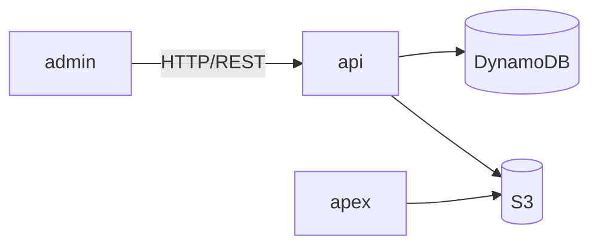

# Template: DEPENDENCIES.md

Write this document for the entire project. It maps every dependency between
components and every shared resource — the integration surface area.

---

## Required Sections

### Component Dependencies

For each component, list what it depends on and what depends on it:

```
### api
- **Depends on**: DynamoDB, S3, AWS Cognito
- **Depended on by**: admin (REST API), apex (shared storage)
- **Integration type**: REST endpoints consumed by admin; shared S3 buckets with apex
```

### Dependency Graph

Mermaid diagram showing all component-to-component and component-to-resource edges:



### Shared Resources

For each shared resource, document:

```
### DynamoDB
- **Used by**: api (read/write), apex (read-only)
- **Tables**: list key tables
- **Access pattern**: single-table design, GSI-based queries
- **Config**: table names in environment variables
```

### API Contracts

For each component-to-component integration, document:

- Protocol (REST, gRPC, events, shared DB)
- Key endpoints or channels
- Auth mechanism between components
- Data formats (JSON, protobuf, etc.)

### Environment Variables

Shared config that crosses component boundaries:

- Variable name, which components use it, what it configures
- Secrets management approach

### Data Flow Boundaries

Where data enters and leaves the system:

- External APIs consumed
- Webhooks received
- User-facing endpoints
- Background jobs / scheduled tasks

---

## Quality Bar

- Every dependency must be bidirectional (A depends on B → B is depended on by A)
- Include Mermaid dependency graph
- File paths for config files that define integrations
- 40-100 lines target
